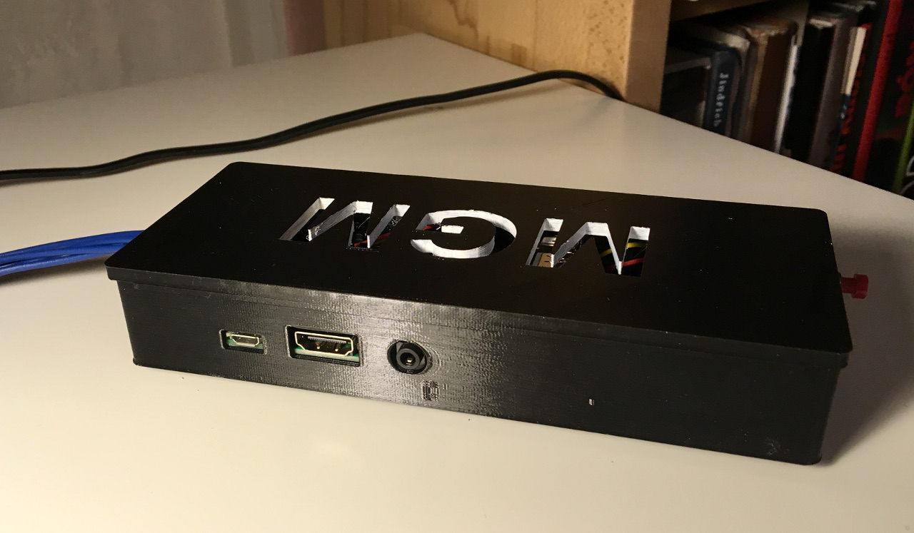
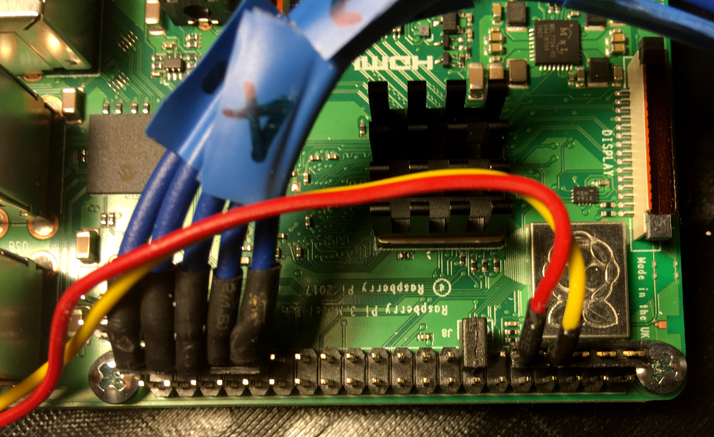
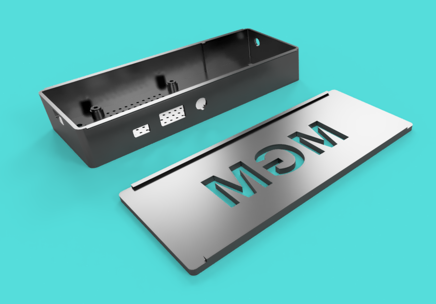
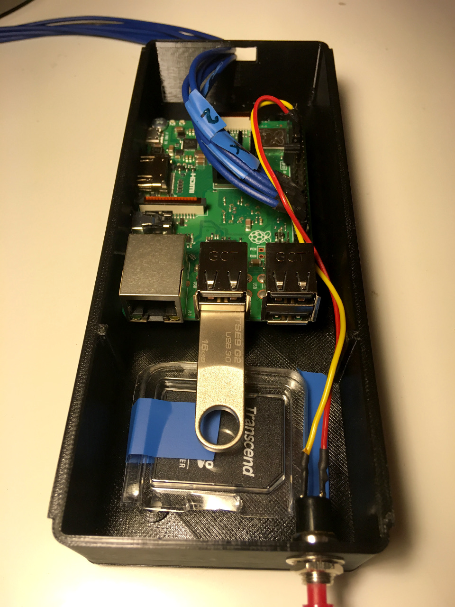

**Raspberry Pi based images and video presenter, originaly build for exhibition on MGM ([gobelin.cz](http://www.gobelin.cz/en)).**

Main idea of this project is to create HW device which will be able to present images and videos from
USB disk on arbitrary HDMI monitor/TV controlled by physical buttons instead of overcomplicated
TV remotes. Also, we want to bypass proprietary builtin monitor/TV SW for image presentation,
since it is hard to find and use it.  
By providing own HW/SW I can control whole process and tune it according to users needs.

# How it works

After powering TV & Raspberry, Raspbian Lite OS automatically launch `tapestry` program. Content
of automounted USB disk will be scanned and simple menu with directory names appears on screen.
After selection of item, image gallery or video player will present the visual content.

System booted from SD card is in read-only mode, which means that it is safe to poweroff
device in any time. Content of the presentation is stored on automounted USB disk, so further
content modification is possible by providing new directory content.

Physical buttons are connected to GPIO pins of Raspberry Pi and translated to keyboard events
by [Adafruit Retrogame utility](https://github.com/adafruit/Adafruit-Retrogame). Read only
system is made by [`read-only-fs.sh`](https://learn.adafruit.com/read-only-raspberry-pi/)
script by Adafruit.

NOTE: Raspberry Pi 3 B+ was used in MGM installation. I tried also older models, but I wasn't
satisfied with the speed of image rendering.

# Controls

Four physical buttons are connected to Raspberry Pi: `back`, `up`, `down`, `ok`.

During photo gallery presentation, user can pause/play presentation by pressing `ok`, 
or cycle back/forward through `up/down` buttons.

During video playback, controls `up/down` serve for volume change, `ok` button for play/pause.

In both cases `back` button will stop actual action and show main screen with menu and
directory list.

# USB content

Content for presentation is stored on external USB disk. You need to follow this directory structure:

    /data
        config.ini
        subdir1/
            image1.jpg
            image2.jpg
            config.ini
            titles.txt
        subdir2/
            movie.avi
            config.ini

File `titles.txt` is optional (see below), name of individual subdirs is up to you (they will be
rendered in main menu), name of the images/videos is again up to you.

Description of `config.ini` and `titles.txt` files is below.

# Configs

`tapestry` program can be configured by `config.ini` files.

There are 2 types of configs:

* config file in root directory (by default `/usb/data/config.ini`) control look and feel
  of main menu
* config file in data subdirectories (like `/usb/data/mysubdir/config.ini`) control image
  presenter

In both cases, config files need to be written in Windows INI format.

## Menu config

Default settings:

    [menu]
    fontsize = 24
    screen_background = #000000
    screen_color = #ffffff
    cursor_background = #ffffff
    cursor_color = #000000
    y_spacing = 10
    x_padding = 20
    y_padding = 3

Description:

* `fontsize` -- font size in menu
* `screen_background` -- background of the menu screen
* `screen_color` -- font color of the items in menu
* `cursor_background` -- color of menu bar (selected item)
* `cursor_color` -- color of font on selected item
* `y_spacing` -- extra `y` spacing between menu items
* `x_padding` -- `x` padding of menu item bar
* `y_padding` -- `y` padding of menu item bar

## Gallery config

Default settings:

    [gallery]
    autoplay = 0
    delay = 5000
    fontsize = 64
    margin = 20
    screen_background = #000000
    screen_color = #ffffff

Description:

* `autoplay` -- value `1` mean autoplay, ie after user select some image directory, all image
  content will be gradually rendered on screen; value `0` mean no autoplay, user will need
  manualy change images by pressing `up/down` buttons
* `delay` -- for how long individual image will be rendered on screen in `autoplay` mode
* `fontsize` -- font size of titles
* `screen_background` -- background color
* `screen_color` -- font color of titles
* `margin` -- margin on top/bottom/left/right side of the screen

## Titles config

Gallery directory can optionaly contain `titles.txt` file with image captions. Format of this
file is simple:

    <name_of_the_image.ext>: <caption>

For example:

    03_kotera_capi_1910.jpg: Jan Kotěra, Čápi, před 1911
    04_livora_jaro.jpg: Rudolf Livora, Jaro, 1911

# GPIO pinout

Following GPIOs are used for physical buttons controling `tapestry` SW:

    GPIO   Pin   Meaning
     6     31    Button 4
    13     33    Button 3
    19     35    Button 2
    26     37    Button 1
    GND    39    Common ground wire for buttons

The buttons are connected similarly to [this scheme](https://learn.adafruit.com/assets/42462),
ie. all of them are connected to common ground and each button to individual GPIO.

Configuration connection GPIOs and keyboard letters is stored in `ansible/retrogame.cfg` file.

Part of the read only script is also possibility to define 2 helper inputs:

* Button for halting system (connected tp GPIO4). This button is not necessary, since we have
  read-only system which is safe to turn off in any time without the risk of corrupting SD
  card. Anyway, if you want to be super sure, you can pres this button prior to powering off
  the device.
* Jumper switching the device back into read/write mode. You need to connect pins 13 (GPIO 27)
  and 14 (GND) by jumper, and boot the device. This way you can change some details in system,
  save it to SD card and remove the jumper before next reboot to start in read-only mode again.

    GPIO   Pin   Meaning
     4      7    Halt button
    GND     9   
    27     13    RW switch
    GND    14

# Case

In the `case/` directory are stored files which I use for printing Raspberry Pi case. I want to
hide all non used connectors and hide USB disk inside the case. `*.f3d` are source files,
`*.stl` models ready for 3D printers.

# Installation

## HW preparation

The tapestry presenter is tested on Raspberry Pi 3B+ board, but should work also on another versions.

1. Download [Raspbian Stretch Lite](https://www.raspberrypi.org/downloads/raspbian/)
2. Install it on SD card (by [Etcher](https://www.balena.io/etcher/) or similar tool)
3. Create empty `ssh` file in the root folder on SD card. This will enable SSH daemon on Raspbery Pi
   (details in [official docs](https://www.raspberrypi.org/documentation/remote-access/ssh/))
4. Start Raspberry Pi. Notice `My IP address is a.b.c.d` message
5. Run Ansible playbook (details below)

Once Ansible playbook finish its job, your Raspberry will be restarted and presentation SW called
`tapestry` will be started. Read **Data USB** section with description how to prepare images for
presentation.

## Ansible

Ansible playbook stored in `ansible/playbook.yml` contain whole recipe for setup Raspbery Pi into
presentation device.

You need to install Ansible on your machine or use it's Dockerised version.

If you have Ansible on your host, follow just steps (3) and (5).

1. Go to the `ansible/` directory
2. Build Docker image with Ansible binaries by running `docker build -t tapestry-ansible .`
3. Replace IP address in `ansible/hosts` by your value (it is displayed on Raspberry Pi bootup)
4. Run container `docker run -ti --rm --entrypoint bash -v $PWD:/app tapestry-ansible` in `ansible/`
   directory
5. Run playbook turning your generic Rasperry into `tapestry` device by 
   `ansible-playbook playbook.yml --extra-vars "pipassw=<pw>" -i ./hosts -k` command. **Beware!**,
   you need to replace `<pw>` by your own password (once the Ansible finish its job, you will
   be able to login to Raspberry as user `pi` with this password).  
   On the very begining you will be asked for current Raspberry password, which is `raspberry`
   by default.

# Font

Roboto condensed font is used in project which is licensed by Apache License, Version 2.0

---

Just for the record -- images on final USB disk was scaled to 1920x1080 px with JPG quality 96%
(progressive, optimalized). Some of the source images was in CMYK color space, they must be 
converted to RGB.
